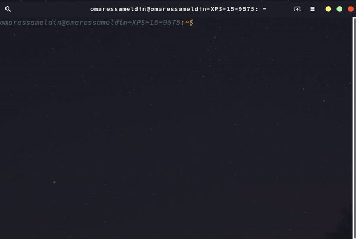
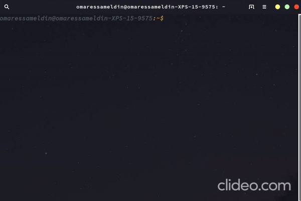
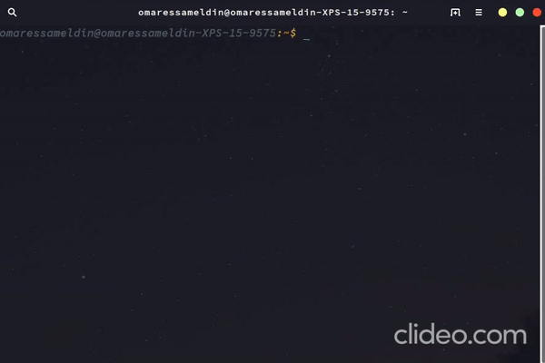
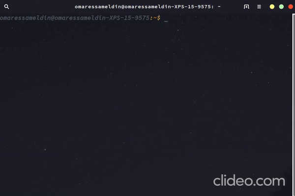
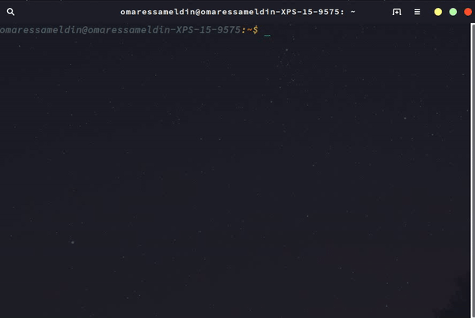

# Wifi Manager
A golang cli to manage wifi networks, using [nmcli](https://developer.gnome.org/NetworkManager/stable/nmcli.html)

## How to install
- Download package from [releases](https://github.com/omaressameldin/wifi-manager/releases/)
- mv package to **/usr/local/bin** `cp wifi-manager /usr/local/bin`

## How to use
- **There are 5 commands available in the app:**
  - help:
      - for showing useful info about available commands`
      - **example:** `wifi-manager`
  
  - list:
    - for listing available wifi netwokrs
    - **example:** `wifi-manager list --name --bars`
  
  - info:
      - for showing all info about one of saved wifis
      - **example:** `wifi-manager info --main --password`
  
  - con:
      - for connecting to a saved or a new network
      - **example:** `wifi-manager con`
  
  - delete:
      - for deleting a saved network
      - **example:** `wifi-manager delete`
  
  - restart:
      - for restarting network manager
      - **example:** `wifi-manager restart`
  

## packages used
- [os/exec](https://golang.org/pkg/os/exec/)
- [Cobra](https://github.com/spf13/cobra#flags)
- [Promptui](https://github.com/manifoldco/promptui)
- [Spinner](https://github.com/briandowns/spinner)